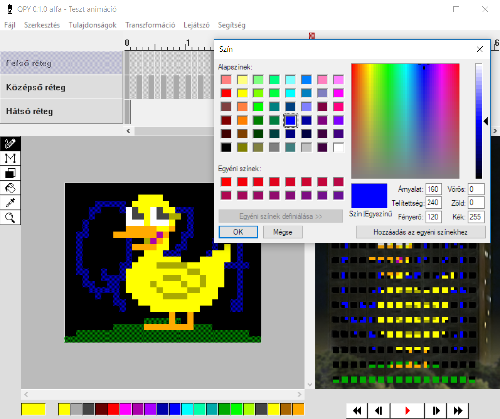

# QPY animáció szerkesztő
A **QPY** egy LED fal animáció szerkesztő alkalmazás, amely a [Schönherz QPA](https://hu.wikipedia.org/wiki/Sch%C3%B6nherz_Qpa) Mátrix eseményére lett létrehozva. Az eseményről a www.oriaskijelzo.hu oldalon olvashatsz többet. Ha még nem vettél részt rajta, nézd meg a videót:

[![Tarts Velem - Schönherz Mátrix 2017 | Drónfelvétel [4K]](http://img.youtube.com/vi/1sqLbh-WmbM/maxresdefault.jpg)](https://www.youtube.com/watch?v=1sqLbh-WmbM "Tarts Velem - Schönherz Mátrix 2017 | Drónfelvétel [4K]")

# Tartalom

1. [Installálás](#installálás)
2. [Szerkesztés](#szerkesztés)
3. [Exportálás](#exportálás)
	
## Installálás

Windows alatt **[töltsd le a szerkesztőt](https://github.com/sedthh/schonherz-matrix/raw/master/qpy.zip)** és csomagold ki a **qpy.zip** fájlt. A mappában lévő **editor.exe** megnyitásával indul a szerkesztő.

**VAGY** 

Telepítsd a [Python3.6+](https://www.python.org/downloads/) vagy újabb verzióját és futtasd a forráskódot (ez Windows mellett MacOs X és Linux alatt is elérhető). A python kód futtatásához még a [VLC letöltésére](https://www.videolan.org/vlc/index.html) és az alábbi csomagok telepítésére van szükség (Windows alatt írd be ezeket a parancssorba. MacOs X és Linux alatt lehet, hogy elé kell írnod, hogy "sudo"):

```python
> pip3 install asyncio
> pip3 install python-vlc
```

Emellett a [tkinter](https://tkdocs.com/tutorial/install.html) könyvtárra van még szükség, ha alapból nincs benn a Python disztribúcióban. A zenelejátszáshoz az alkalmazás a [VLC](https://www.videolan.org/vlc/index.html) plugin fájljait használja.

A szükséges könyvtárak telepítése után a python (\*.py vagy \*.pyw) program fájlok futtathatóvá vállnak, dupla kattintással, vagy szintén parancssorból:

```python
> python editor.pyw
```

*Minden visszajelzést és segítséget szívesen fogadunk az alkalmazással kapcsolatban!*



## Szerkesztés
Az eszköztár eszközeinek segítségével a színpadra és az előnézeti ablakra is lehet rajzolni. A rajzok a kijelölt réteg, kijelölt képkockáján belül jelennek meg. Rajzolni az egér bal gombjával, törölni a jobb gombjával lehet. 

 ceruza eszköz: bal egérgombbal rajzolni, jobbal törölni tudsz

 vonal eszköz: bal egérgombbal vonalat rajzolni, jobbal vonal alakban törölni lehet felengedés után

 négyszög eszköz: bal egérgombbal négyszöget rajzolni, jobbal négyszög alakban törölni lehet felengedés után

 festékes vödör eszköz: bal egérgombbal azonos színű területet átszínezni, jobbal azonos színű területet törölni lehet

 színválasztó eszköz: adott terület színét lehet felvenni a használatban lévő szín helyére (az előnézeti képen minden réteget figyelembe vesz, a szerkesztő felületen csak az aktuális réteg pixeleit), bal egérgomb használatakor átvált ceruzára

 nagyító eszköz: bal egérgombbal a szerkesztő felülletet nagyítani, jobbal kicsinyíteni lehet (előnézeti képen nincs hatása)

A rétegek között kattintással vagy a tabulátorral tudsz váltani. A nem aktív rétegek félig átlátszóak lesznek a szerkesztőablakban, hogy megkönnyítsék az animálást. 

A kijelölés, kivágás, másolás és beillesztés csak képkockákra és a teljes tartalmaikra működik (vagyis egyszerre több képkocka vagy a rajz csak egy adott részterüllete nem jelölhető külön ki). Másolni és beilleszteni képkockát egyszerre megnyitott szerkesztők között is lehet, de bezáráskor a vágólap tartalma törlődni fog. 

Mozgatni rajzot a nyilakkal és a transzformációs menü mozgatási parancsaival lehet. A transzformációk között elérhető tükrözés és forgatás is. A szerkesztés megkönnyítésére a legtöbb funkcióhoz elérhetők **billentyűparancsok** is. 

Lejátszás alatt csak az előnézeti ablak frissül, ezzel minimalizálva a kirajzolás okozta laget.

**PROTIP:** *Ha esetleg idén is tetriszt, snake-et, pohárból elfogyó sört vagy scrollozó csapatnevet akarnál rakni az animációdba, kérd meg egy másik csapattársadat, hogy készítsen helyetted animációt.*

A gyakori mentés ajánlott! Amennyiben valamiért túlságosan lassúvá válik az alkalmazás és csak rövidebb animációkat tudsz vele létrehozni a gépeden, exportáld ki a rövidebb animációkat és vágd össze őket egy \*.qp4 LUA kóddá az *AniimEditor2012* szerkesztőhöz. Ha egy újabb verzióval, javításokkal nem várt problémák jönnek elő, a régebbi verziók ugyanúgy elérhetőek itt a [GitHub](https://github.com/sedthh/schonherz-matrix/releases)-on. A megnyitás/mentés felugró fájl ablakai néha megfagynak Windows 10 alatt, ez sajnos az ablakkezelő könyvtár hibája.

## Exportálás
A QPA FTP-re való feltöltéshez először **exportálni** kell a kész animációt. Az exportálás után létrejövő fájl már megnyitható az eddig használt *AnimEditor2012* szerkesztőben is. 