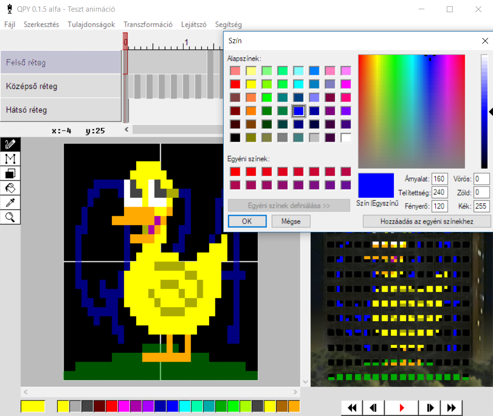

# QPY animáció szerkesztő
A **QPY** egy LED fal animáció szerkesztő alkalmazás, amely a [Schönherz QPA](https://hu.wikipedia.org/wiki/Sch%C3%B6nherz_Qpa) Mátrix eseményére lett létrehozva. Az eseményről a www.oriaskijelzo.hu oldalon olvashatsz többet. Ha még nem vettél részt rajta, nézd meg a videót:

[![Tarts Velem - Schönherz Mátrix 2017 | Drónfelvétel [4K]](http://img.youtube.com/vi/1sqLbh-WmbM/maxresdefault.jpg)](https://www.youtube.com/watch?v=1sqLbh-WmbM "Tarts Velem - Schönherz Mátrix 2017 | Drónfelvétel [4K]")

# Tartalom

1. [Installálás](#installálás)
2. [Szerkesztés](#szerkesztés)
3. [Exportálás](#exportálás)
4. [FAQ](#faq)
	
## Installálás

Windows alatt **[töltsd le a szerkesztőt](https://github.com/sedthh/schonherz-matrix/raw/master/qpy.zip)** és csomagold ki a **qpy.zip** fájlt. A benne lévő **editor.exe** megnyitásával indul a szerkesztő.

**VAGY** 

Töltsd le a teljes repót és futtasd az **editor.pyw** forráskódot [Python 3.6+](https://www.python.org/downloads/) alatt, bármely más operációs rendszeren.

## Szerkesztés
Az eszköztár eszközeinek segítségével a színpadra és az előnézeti ablakra is lehet rajzolni. A rajzok a kijelölt réteg, kijelölt képkockáján belül jelennek meg. Rajzolni az egér bal gombjával, törölni a jobb gombjával lehet. 

 ceruza eszköz: bal egérgombbal rajzolni, jobbal törölni tudsz

 vonal eszköz: bal egérgombbal vonalat rajzolni, jobbal vonal alakban törölni lehet felengedés után

 négyszög eszköz: bal egérgombbal négyszöget rajzolni, jobbal négyszög alakban törölni lehet felengedés után

 festékes vödör eszköz: bal egérgombbal azonos színű területet átszínezni, jobbal azonos színű területet törölni lehet

 színválasztó eszköz: adott terület színét lehet felvenni a használatban lévő szín helyére (az előnézeti képen minden réteget figyelembe vesz, a szerkesztő felületen csak az aktuális réteg pixeleit), bal egérgomb használatakor átvált ceruzára

 nagyító eszköz: bal egérgombbal a szerkesztő felülletet nagyítani, jobbal kicsinyíteni lehet (előnézeti képen nincs hatása)

A rétegek között kattintással vagy a tabulátorral tudsz váltani. A nem aktív rétegek félig átlátszóak lesznek a szerkesztőablakban, hogy megkönnyítsék az animálást. 

A kijelölés, kivágás, másolás és beillesztés csak képkockákra és a teljes tartalmaikra működik (vagyis egyszerre több képkocka vagy a rajz csak egy adott részterüllete nem jelölhető külön ki). Másolni és beilleszteni képkockát egyszerre megnyitott szerkesztők között is lehet, de bezáráskor a vágólap tartalma törlődni fog. 

Mozgatni rajzot a nyilakkal és a transzformációs menü mozgatási parancsaival lehet. A transzformációk között elérhető tükrözés és forgatás is. A szerkesztés megkönnyítésére a legtöbb funkcióhoz elérhetők **billentyűparancsok** is (emellett a számokkal eszköztár elemeket, az egér görgővel színeket lehet választani a színpadon). 

**PROTIP:** *Ha esetleg idén is tetriszt, snake-et, pohárból elfogyó sört vagy scrollozó csapatnevet akarnál rakni az animációdba, kérd meg egy másik csapattársadat, hogy készítsen helyetted animációt.*

## Exportálás
A QPA FTP-re való feltöltéshez először **exportálni** kell a kész animációt. Az exportálás után létrejövő fájl már megnyitható az eddig használt *[AnimEditor2012](https://oriaskijelzo.sch.bme.hu/wp-content/uploads/2018/06/animeditor_2012_win32.zip)* szerkesztőben is. 

**Animáció feltöltéskor ne felejtsétek el mellékelni az MP3 fájlt is!**

## FAQ

- Amennyiben valamiért túlságosan lassúvá válik az alkalmazás (~500 képkocka fölött) és csak rövidebb animációkat tudsz vele létrehozni a gépeden, exportáld ki a rövidebb animációkat és utólag vágd össze őket. A kiexportált animációk újra ugyanúgy beimportálhatóak. 

- Manuálisan összevágni a kiexportált részeket LUA kódként a régi *[AnimEditor2012](https://oriaskijelzo.sch.bme.hu/wp-content/uploads/2018/06/animeditor_2012_win32.zip)* szerkesztővel is lehet. Szóval ha valami nagyon nem megy, még mindig tudjátok a régi szerkesztőben használni az elkészült részeket.

- A megnyitás/mentés felugró fájl ablakai néha megfagynak Windows 10 alatt, ez sajnos az ablakkezelő könyvtár hibája.

- Ha egy újabb verzióval, javításokkal nem várt problémák jönnek elő, a régebbi verziók ugyanúgy elérhetőek itt a [GitHub](https://github.com/sedthh/schonherz-matrix/releases)-on. 

- A zenelejátszáshoz az alkalmazás a FFMPEG-et használ.

- Ha a Windows defender nem akarja engedni a futtatást, kattints a (további információ alatt) "Futtatás mindenképpen" gombra. Ugyanaz a python kód van futtatható exe fájlként a könyvtáraival becsomagolva, amit a GIT repoban is látsz. 

- Két fajta lejátszás létezik: lejátszás innen (space) és lejátszás az elejétől (enter) amelyek máshonnan indítják a lejátszást és megálláskor máshova ugranak vissza a szerkesztőben. A piros lejátszó gomb az aktuális pozíciótól kezd el játszani. A visszatekerő gombbal léphetsz az animáció elejére.

- A tulajdonságok menüben a "Színpad nyújtása" kiválasztásával vagy a 0 gombbal lehet a szerkesztőfelület pixeleinek arányát változtatni, hogy jobban hasonlítson a végeredményre a Schönherz falán. 

- A timeline-on látható képkockákat a szerkesztés menüben, a képkockákon jobb klikkel, vagy gyorsbillentyűkkel lehet manipulálni (új képkockát beszúrni, duplikálni, törölni, stb.). Egy képkocka 100 milliszekundum időtartamot jelent, 10 képkocka 1 másodpercnyi animációt. 